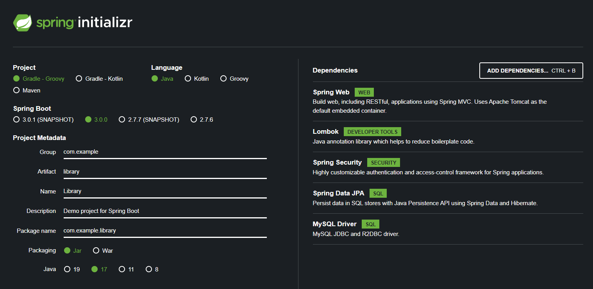
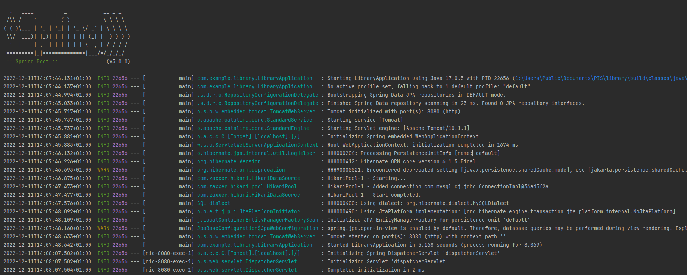
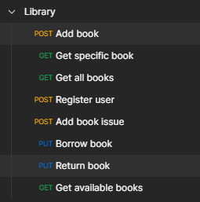
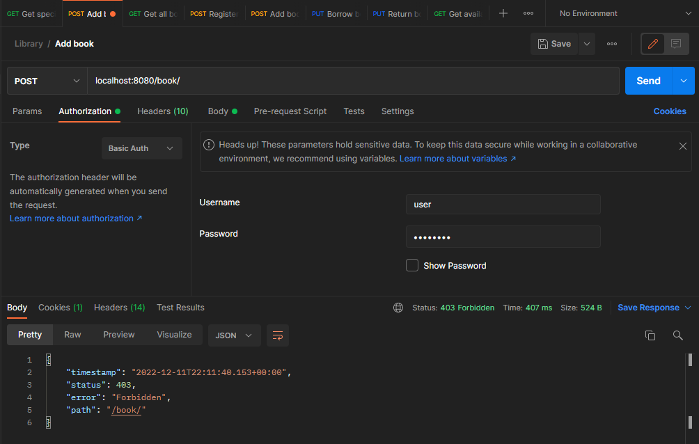

# Spring boot - Wprowadzenie

W tym przewodniku pokażę krok po kroku jak wykonać podstawowe REST API od zera. Postaram się zawrzeć informacje o popularnych bibliotekach wykorzystywanych w tego typu aplikacjach.

## Czym jest Spring Framework?

Spring Framework to popularny szkielet tworzenia aplikacji w język Java. Oferuje dużą swobodę w tworzeniu rozwiązań, a jednocześnie jest dobrze udokumentowany. Pozwala na szybkie przygotowanie aplikacji webowych. Zawiera rozwiązania wielu zagadnień technicznych napotykanych przez programistów.

Bazuje na koncepcji Inversion of Control. Programista nie musi sam tworzyć poszczególnych komponentów, a jedynie anotuje obiekty (`@Component`). Spring sam w czasie wykonania programu zajmuje się powoływaniem obiektów do życia i wystrzykiwaniem zależności w obiekty, które tego wymagają (`@Autowired`).

## Wymagania

Przed przystąpieniem do wprowadzenia proszę o zainstalowanie wymaganych programów:
- java - w wersji 8, 11, 17 lub 19
- gradle lub maven
- docker
- ulubione IDE np. IntelliJ

## Zadanie

Postaram się przedstawić Spring na podstawie zadania:
```
Przygotuj aplikację wspierającą bibliotekę. Aplikacja powinna umożliwiać operacje zapisu i odczytu na książkach, użytkownikach oraz powinna pozwolić na przechowywanie informacji o wypożyczonych książkach. Aplikacja powinna korzystać z basic auth, aby ograniczyć uprawnienia użytkowników np. dodawanie książek powinno być ograniczone jedynie do administratora systemu (użytkownik o loginie admin).
```

## Początek

Aplikację z wykorzystaniem Springa najłatwiej zainicjować korzystając ze strony [spring initializr](https://start.spring.io/).



Można zmodyfikować domyślną konfigurację wybraną zaproponowaną przez Initializr. 

Ja jedynie zmodyfikowałem metadane projektu oraz wybrałem podstawowe zależności:
- Spring Web - podstawowy komponent dla aplikacji RESTowych. Korzysta z Tomcat-a jako domyślny wbudowany kontener,
- Spring Security - moduł, który pozwala ograniczyć dostęp do wybranych adresów,
- Spring Data JPA - biblioteka pozwalająca na przechowywanie danych z wykorzystaniem JPA oraz Hibernate,
- Lombok - biblioteka generująca podstawowe funkcjonalności na podstawie anotacji nad klasą,
- MySQL Driver - sterownik dla bazy z której skorzystam.

Spring Initializr pozwala na wygenerowanie zip-a z kodem, pozostaje jedynie pobranie oraz otworzenie kodu w ulubionym IDE.

## Baza danych

Rozpocznę od przygotowania bazy danych. Postawię bazę MySql w środowisku dockera. Skorzystam do tego z odpowiedniego pliku `docker-compose.yml`:
```yml
version: '3.8'
services:
    db:
        image: mysql:8.0.31
        container_name: mysql
        environment:
            MYSQL_DATABASE: 'db'
            MYSQL_USER: 'user'
            MYSQL_PASSWORD: 'password'
            MYSQL_ROOT_PASSWORD: 'password'
        ports:
            - '3306:3306'
        expose:
            - '3306'
        volumes:
            - ../data/mysql/:/var/lib/mysql
```

Uruchomienie zdefiniowanej bazy sprowadza się do wywołania komendy w folderze z plikiem:
```s
docker-compose up -d
```

Należy zmodyfikować odpowiednio plik konfiguracyjny `src/main/java/resources/`:
```properties
spring.datasource.url=jdbc:mysql://localhost:3306/db
spring.datasource.username=user
spring.datasource.password=password
```

Aby pozwolić aplikacji samej na wygenerowanie odpowiednich tabel na podstawie kodu można także zdefiniować następujące wartości:
```properties
spring.jpa.hibernate.ddl-auto=update
spring.jpa.generate-ddl=false
```

## Pierwsze uruchomienie

Tak przygotowaną aplikację jestem w stanie odpalić bezpośrednio z poziomu IDE uruchamiając zdefiniowaną funkcję `main`:
```java
@SpringBootApplication
public class LibraryApplication {
	public static void main(String[] args) {
		SpringApplication.run(LibraryApplication.class, args);
	}
}
```
lub z poziomu konsoli z wykorzystaniem gradle zdefiniowanego zadania `bootRun`:
```s
./gradlew bootRun
```



Na razie po uruchomieniu pod adresem http://localhost:8080/ powinna pojawić się strona z kodem błędu 404 - nie znalezione, ponieważ nie zdefiniowałem jeszcze żadnego punktu wejściowego.

## Pierwszy endpoint

Rozpocznę od przygotowania endpointu witającego wchodzących na stronę serwera.

**/controller/HelloController.java**
```java
@RequestMapping("/greet")
@RestController
public class HelloController {
	@GetMapping({"/{name}", "", "/"})
	public String greet(@PathVariable(required = false) String name) {
		String greet = Optional.ofNullable(name).orElse("World");
		return String.format("Hello, %s!", greet);
	}
}
```

Postaram się wytłumaczyć co oznaczają poszczególne anotacje:
- `@RestController` - podstawowy komponent, który jest rozpoznawany przez Spring MVC, aby obsługiwać zapytania na poszczególne adresy URL,
- `@RequestMapping` - anotacja pozwalająca na określenie URL pod którym dostępny będzie kontroler,
- `@GetMapping` - anotacja pozwalająca na określenie relatywnego adresu, pod którym dostępna będzie metoda kontrolera,
- `@PathVariable` - określenie skąd dany parametr funkcji powinien być pobierany - w tym przypadku parametr jest brany bezpośrednio z url funkcji.

Rezultat:


## Model danych

Przygotuję trzy klasy książkę, egzemplarz książki oraz użytkownika. Dzięki podaniu anotacji nie muszę tworzyć dodatkowo schematu bazy danych - spring za mnie wygeneruje odpowiednie tabele oraz korzysta z JPA, przez co spring załatwia mapowanie obiektów z tabeli relacyjnej do obiektów jav-owych.

**/entity/Book.java**
```java
@Builder
@NoArgsConstructor
@AllArgsConstructor
@Getter
@Setter
@ToString
@EqualsAndHashCode
@Entity
@Table(name = "BOOKS")
public class Book {
	@Id
	@Column(nullable = false, unique = true, length = 13)
	private String isbn;
	@Column(nullable = false, length = 100)
	private String title;
	@Column(nullable = false, length = 100)
	private String author;
	@Column(length = 500)
	private String description;
}
```

**/entity/User.java**
```java
@Builder
@NoArgsConstructor
@AllArgsConstructor
@Getter
@Setter
@ToString
@EqualsAndHashCode
@Entity
@Table(name = "USERS")
public class User {
	@Id
	@GeneratedValue
	@Column(nullable = false, unique = true, precision = 8)
	private Integer id;
	@Column(nullable = false, unique = true, length = 50)
	private String login;
	@Column(nullable = false, length = 512)
	private String password;
}
```

**/entity/Issue.java**
```java
@Builder
@NoArgsConstructor
@AllArgsConstructor
@Getter
@Setter
@ToString
@EqualsAndHashCode
@Entity
@Table(name = "ISSUES")
public class Issue {
	@Id
	@GeneratedValue
	@Column(nullable = false, unique = true, precision = 9)
	private Integer id;
	@Column(nullable = false, length = 13)
	private String isbn;
	@Column(precision = 8)
	private Integer userId;
	private Timestamp bookBorrowDate;
}
```

Anotacje Lomboka przydają się do redukcji kodu boilerplate:
- `@Builder` - dodaje klasę Builder, za pomocą której w przystępny sposób można inicjować klasę,
- `@NoArgsConstructor` - dodaje konstruktor bez argumentów,
- `@AllArgsConstructor` - dodaje konstruktor przyjmujący wszystkie pola klasy,
- `@Getter` - tworzy gettery dla wszystkich pól
- `@Setter` - tworzy settery dla wszystkich pól
- `@ToString` - generuje metodę `toString()`, z formatem, który drukuje wszystkie zmienne z klasy,
- `@EqualsAndHashCode` - generuje metody domyślne metody `equals()` i `hashCode()`.

Anotacje wymagane do przez JPA:
- `@Entity` - definiuje encję,
- `@Table` - pozwala na ustawienie tabeli głównej,
- `@Id` - definiuje jakie pole wchodzi w skład id,
- `@Column` - pozwala dodać właściwości kolumn z bazy danych.

## Repozytoria

Spring Data udostępnia podstawowe implementacje repozytoriów korzystających z bazy zdefiniowanej w konfiguracji springa. Pozwala to na generowanie repozytoriów jedynie poprzez dodanie interfejsu rozszerzającego odpowiednie `CrudRepository` oraz dodanie anotacji `@Repository`.

**/repository/BookRepository.java**
```java
@Repository
public interface BookRepository extends CrudRepository<Book, String> {
	@Query("SELECT b FROM Book b INNER JOIN Issue i ON b.isbn = i.isbn WHERE i.userId IS NULL")
	Iterable<Book> findAvailableBooks();
}
```

**/repository/UserRepository.java**
```java
@Repository
public interface UserRepository extends CrudRepository<User, Integer> {
	Optional<User> findByLogin(String login);
}

```

**/repository/IssueRepository.java**
```java
@Repository
public interface IssueRepository extends CrudRepository<Issue, Integer> {
	List<Issue> findAllByIsbnAndUserIdIsNull(String isbn);
}
```

Spring generuje podstawowe funkcjonalności za nas, a także udostępnia możliwość definiowania własnych zapytań:
- anotacja `@Query` - sami definiujemy zapytanie do bazy danych,
- funkcja odpowiednio nazwana np. `findAllByIsbnAndUserIdIsNull`.


## Serwis

Zdefiniuję najpierw interfejs serwisów - jakie funkcjonalności będą potrzebne w projektowanym systemie.

**/service/BookService.java**
```java
public interface BookService {
	Optional<Book> getBookById(String isbn);
	Iterable<Book> getAvailableBooks();
	Iterable<Book> getBooks();
	Book saveBook(Book book);
}
```

**/service/UserService.java**
```java
public interface UserService {
	Optional<User> findUserByLogin(String login);
	User saveUser(User user);
}
```

**/service/IssueService.java**
```java
public interface IssueService {
	Optional<Issue> borrowIssue(String isbn, Integer userId);
	Optional<Issue> returnIssue(Integer issueId, Integer userId);
	Issue addIssue(String isbn);
}
```

To właśnie serwis powinien zajmować się logiką biznesową aplikacji.

Do implementacji tych serwisów dodam anotację `@Service`, aby spring mógł poprawnie wstrzyknąć komponent oraz anotację `@RequiredArgsConstructor(onConstructor_ = @Autowired)`, która generuje konstruktor z polami oznaczonymi jako `final` i dodaje do niego anotację `@Autowired`. Sygnalizuje ona springowi, aby wstrzyknąć tutaj odpowiedni komponent `@Repository` odpowiadający zdefiniowanemu interfejsowi.

**/service/BookServiceImpl.java**
```java
@RequiredArgsConstructor(onConstructor_ = @Autowired)
@Service
public class BookServiceImpl implements BookService {
	private final BookRepository bookRepository;
	@Override
	public Optional<Book> getBookById(String isbn) {
		return bookRepository.findById(isbn);
	}
	@Override
	public Iterable<Book> getAvailableBooks() {
		return bookRepository.findAvailableBooks();
	}
	@Override
	public Iterable<Book> getBooks() {
		return bookRepository.findAll();
	}
	@Override
	public Book saveBook(Book book) {
		return bookRepository.save(book);
	}
}
```

**/service/UserServiceImpl.java**
```java
@RequiredArgsConstructor(onConstructor_ = @Autowired)
@Service
public class UserServiceImpl implements UserService {
	private final UserRepository userRepository;
	@Override
	public Optional<User> findUserByLogin(String login) {
		return userRepository.findByLogin(login);
	}
	@Override
	public User saveUser(User user) {
		return userRepository.save(user);
	}
}
```

**/service/IssueServiceImpl.java**
```java
@RequiredArgsConstructor(onConstructor_ = @Autowired)
@Service
public class IssueServiceImpl implements IssueService {
	private final IssueRepository issueRepository;
	@Override
	@Transactional
	public Optional<Issue> borrowIssue(String isbn, Integer userId) {
		return issueRepository.findAllByIsbnAndUserIdIsNull(isbn)
				.stream()
				.findAny()
				.map(issue -> {
					issue.setUserId(userId);
					issue.setBookBorrowDate(new Timestamp(System.currentTimeMillis()));
					return issue;
				})
				.map(issueRepository::save);
	}
	@Override
	public Optional<Issue> returnIssue(Integer issueId, Integer userId) {
		return issueRepository.findById(issueId)
				.filter(issue -> Objects.equals(issue.getUserId(), userId))
				.map(issue -> {
					issue.setUserId(null);
					issue.setBookBorrowDate(null);
					return issue;
				})
				.map(issueRepository::save);
	}
	@Override
	public Issue addIssue(String isbn) {
		return issueRepository.save(
				Issue.builder().isbn(isbn).build()
		);
	}
}
```

# Kontroler

Na koniec zdefiniuję wejścia do aplikacji - funkcje, które udostępnia API.

**/controller/BookController.java**
```java
@RequiredArgsConstructor(onConstructor_ = @Autowired)
@RequestMapping("book")
@RestController
public class BookController {
	private final BookService bookService;
	@GetMapping("/{isbn}")
	public Book getBookByIsbn(@PathVariable String isbn) {
		return bookService.getBookById(isbn).orElse(null);
	}
	@GetMapping("/available")
	public Iterable<Book> getAvailableBooks() {
		return bookService.getAvailableBooks();
	}
	@GetMapping({"/", ""})
	public Iterable<Book> getBooks() {
		return bookService.getBooks();
	}
	@PostMapping({"/", ""})
	public Book saveBook(@RequestBody Book book) {
		return bookService.saveBook(book);
	}
}
```

**/controller/UserController.java**
```java
@RequiredArgsConstructor(onConstructor_ = @Autowired)
@RequestMapping("user")
@RestController
public class UserController {
	private final UserService userService;
	@PostMapping({"/", ""})
	public User register(@RequestBody User user) {
		return userService.saveUser(user);
	}
}
```

**/controller/IssueController.java**
```java
@RequiredArgsConstructor(onConstructor_ = @Autowired)
@RequestMapping("borrow")
@RestController
public class IssueController {
	private final IssueService issueService;
	@PutMapping("{isbn}")
	public Issue borrowIssue(@PathVariable String isbn, Authentication authentication) {
		User user = (User) authentication.getPrincipal();
		return issueService.borrowIssue(isbn, user.getId()).orElse(null);
	}
	@PutMapping("return/{issueId}")
	public Issue returnIssue(@PathVariable Integer issueId, Authentication authentication) {
		User user = (User) authentication.getPrincipal();
		return issueService.returnIssue(issueId, user.getId()).orElse(null);
	}
	@PostMapping("{isbn}")
	public Issue addIssue(@PathVariable String isbn) {
		return issueService.addIssue(isbn);
	}
}
```

## Uwierzytelnienie

Teraz zajmę się ograniczeniem dostępu w zależności od użytkownika systemu. Należy przygotować własną implementację AuthenticationProvider i w zależności od loginu i hasła z bazy danych przydzielić odpowiednio dostęp.

**/security/CustomAuthenticationProvider**
```java
@RequiredArgsConstructor(onConstructor_ = @Autowired)
@Component
public class CustomAuthenticationProvider implements AuthenticationProvider {
	private final UserService userService;
	@Override
	public Authentication authenticate(Authentication authentication) throws AuthenticationException {
		String login = authentication.getName();
		String password = authentication.getCredentials().toString();

		return userService.findUserByLogin(login)
				.filter(user -> Objects.equals(user.getPassword(), password))
				.map(user -> new UsernamePasswordAuthenticationToken(user, password, prepareAuthorities(login)))
				.orElse(null);
	}

	@Override
	public boolean supports(Class<?> authentication) {
		return authentication.equals(UsernamePasswordAuthenticationToken.class);
	}

	private List<GrantedAuthority> prepareAuthorities(String login) {
		List<GrantedAuthority> authorities = new ArrayList<>();
		authorities.add(new SimpleGrantedAuthority(Roles.USER.toString()));
		if (Objects.equals(login, Roles.ADMIN.toString())) {
			authorities.add(new SimpleGrantedAuthority(Roles.ADMIN.toString()));
		}
		return authorities;
	}
}
```

Dodatkowo zdefiniowałem role:
```java
@RequiredArgsConstructor
public enum Roles {
	ADMIN("admin"),
	USER("user");
	private final String name;
	@Override
	public String toString() {
		return name;
	}
}
```

Rolę **admin** posiada jedynie użytkownik o loginie admin, a role **user** posiada każdy zarejestrowany użytkownik.

Pozostaje jedynie ograniczenie widoczności poszczególnych endpointów:
```java
@RequiredArgsConstructor(onConstructor_ = @Autowired)
@Configuration
@EnableWebSecurity
public class SecurityConfiguration {

	private final CustomAuthenticationProvider authenticationProvider;

	@Bean
	public SecurityFilterChain filterChain(HttpSecurity http) throws Exception {
		return http.csrf().disable()
				.cors().and()
				.authorizeHttpRequests(authorize -> {
							authorize.requestMatchers("/user", "/user/").permitAll();
							authorize.requestMatchers(HttpMethod.POST, "/book", "/book/", "/borrow/**").hasAuthority(Roles.ADMIN.toString());
							authorize.anyRequest().authenticated();
						}
				)
				.httpBasic(Customizer.withDefaults())
				.build();
	}

	@Bean
	public AuthenticationManager authManager(HttpSecurity http) throws Exception {
		AuthenticationManagerBuilder authenticationManagerBuilder = http.getSharedObject(AuthenticationManagerBuilder.class);
		authenticationManagerBuilder.authenticationProvider(authenticationProvider);
		return authenticationManagerBuilder.build();
	}
}
```

## Testowanie Manualne

Do testowania manualnego polecam skorzystanie z programu **Postman**, umożliwia on łatwe modyfikowanie nagłówków oraz wykorzystanie różnych metod http (POST, PUT, DELETE, PATCH itd.)

Można zdefiniować sobie zapytania i mieć je w wydzielonej zakładce:



Przygotowałem porównanie próby dodania książki przez użytkownika oraz przez admina:
```json
{
    "isbn":"isbn2",
    "title": "title",
    "author": "Bartłomiej Krawczyk",
    "description": "description"
}
```

Admin bez problemu może dodać książkę do systemu:


jednak zwykły użytkownik nie ma dostępu do tego endpointu:



## W następnym artykule ; )

- testy jednostkowe
- testy integracyjne

# Podsumowanie

Udało się napisać prostą aplikację, która umożliwia:
- powitanie odwiedzających
- rejestrację nowych użytkowników (wszyscy mogą skorzystać z endpointu)
- sprawdzenie czy książka o takim isbn istnieje w księgarni
- przeglądanie dostępnych książek
- przeglądanie wszystkich książek
- dodawanie książek (jedynie admin może skorzystać)
- dodawanie egzemplarzy książek (jedynie admin może skorzystać)
- wypożyczanie książek
- zwracanie książek

```
Autor: Bartłomiej Krawczyk
Github: https://github.com/bartlomiejkrawczyk/LIBRARY-SPRING-BOOT
```